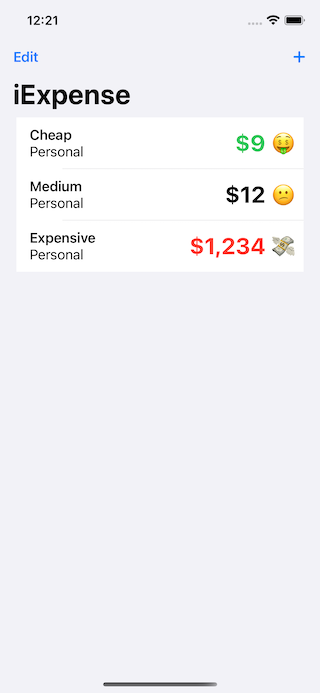
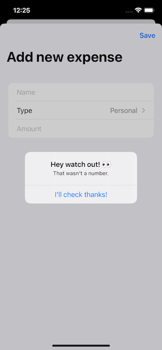

# iExpense (SwiftUI)

It is an expense tracker that separates personal costs from business costs. See how much did you spend and the amounts you spent.

## Demo

| Screenshot 01                  | Screenshot 02                  |
| ------------------------------ | ------------------------------ |
|  |  |

---

**MIT License**
